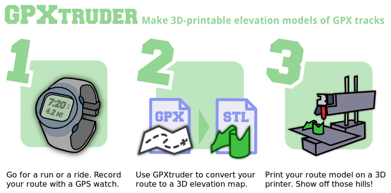

# [GPXtruder](http://gpxtruder.xyz/)

Make 3D-printable elevation models of GPX tracks. Try it now at [gpxtruder.xyz](http://gpxtruder.xyz/).

---

# Quick Reference

Here's how it works:

1. Select a GPX track
2. Set some options
3. Click *Extrude Route*
4. Check out a preview
5. Download an STL model

The interface is divided into two main sections, described in more detail below: the [input panel](#input-panel) and the [output panel](#output-panel).

## Input panel

Use the *Input* panel to select a GPX track and configure how it will be converted to a 3D model.

Select *Upload GPX* to select a `.gpx` file from your computer. (Processing is actually performed by your browser; no files are transmitted.) Alternatively, select *Sample GPX* and choose a built-in route if you just want to try things out.

**GPX files must include elevations.** Some sources provide elevation data and some do not. If GPXtruder reports that your file does not contain any elevation data, run it through [GPS Visualizer's DEM database](http://www.gpsvisualizer.com/elevation) to create a copy that includes elevation data and try again.

---

### Route options

Route options affect how the input GPX track is processed.

#### Vertical exaggeration

This factor is applied to each elevation value. The default value is `5`. The minimum value is `1` (indicating no exaggeration). Try larger factors like `10` or `15` to emphasize hills or enhance the appearance of flat terrain.

#### Clip to minimum elevation

If clipping is enabled, the vertical extent of the output is limited to the span between the route's minimum and maximum elevation. If disabled, the vertical extent will span from sea level to the route's maximum elevation. (If the minimum elevation is below sea level, that will be used instead.) Elevation clipping is enabled by default.

#### Smoothing

Smoothing removes irregularities and reduces the geometric complexity of the output, decreasing file size and processing time. However, it may also reduce the route length and alter the shape or location of corners and curves. *Automatic* smoothing is enabled by default. For more precise control, select *Manual minimum interval*; points that are closer together than the specified interval will be discarded. An interval value of `0` disables smoothing.

---

### Model options

Model options determine what kind of output is generated.

#### Style

Three model styles are possible. The default *Map* style preserves the 2D course of the input GPX track. The *Linear* option unwinds the route into a straight line like a conventional elevation profile. The *Ring* option rolls the elevation profile into a circle so the start and end of the route meet. A basemap is displayed only if the *Map* style is selected.

#### Markers

Markers are rectangular pillars indicating the location, orientation, and elevation of regular intervals along the route. By default, markers are not created. Select *Kilometers* or *Miles* to place markers at each kilometer or mile along the route. Select *Other interval* to enter a custom interval; the default custom interval is 5 miles (`8047` meters).

Markers are generated as a separate model. If markers are enabled, a menu will appear in the output panel allowing you to toggle between the `Profile` and `Markers` models.

---

### Size options

Size options control the size of the output.

#### Bed width and Bed height

Bed dimensions advise GPXtruder of the available print area. The output model is scaled to the maximum size that will fit in the given dimensions. The route may be rotated 90 degrees to fit at a larger scale if possible.

#### Path width

The path width is the thickness of the extruded route. The minimum value is `1` millimeter.

#### Base height

A base adds an extra layer at the bottom of the model. It is intended to ensure the route model does not separate at low elevations. The default base height is `1` millimeter.

---

Once you've selected a GPX track and set your options, click *Extrude Route*. The *Output* panel will scroll into view.

## Output panel

In supported browsers, the *Output* panel will include a 3D preview of the extruded route model. If your browser does not support WebGL, you won't see this display, but you may still be able to download the model.

### Preview controls

Click and drag to rotate the display. Hold *Alt* to swap rotation axes.

Hold *Shift* and click and drag (or click and drag the middle mouse button) to pan the display.

Hold *Control* and click and drag (or use the scroll wheel) to zoom the display.

Click the leftmost icon above the display to reset the initial zoom and perspective. Click the remaining icons to change to the indicated perspective without affecting zoom.

### Download controls

When you click the *Generate STL* button below the preview, it will change to a download link. Click the download link to download a 3D-printable `.stl` version of the extruded route model.

If you enabled markers, use the menu next to the download button to toggle between the profile model and the markers model. This affects the preview display as well as the model that will be downloaded.

If you selected a *Map* style model, the preview may display the route aligned with a Google map of the underlying terrain. Click the *Download PDF* button beneath the preview to download a PDF version of the basemap. Note that the PDF is scaled to match the route model; print both at actual size to display together.

### Parametric CAD Scripts

This section lists two versions of the code GPXtruder generates to convert your GPX track to a 3D `.stl` model. If you just want to print the route model as displayed in the preview, you can safely ignore this section. However, the code may be useful for some custom projects. The code at left is for use with [OpenJSCAD.org](http://openjscad.org/), an online tool; the code at right is for use with [OpenSCAD](http://www.openscad.org/), the original desktop version.

---

## Examples

## Limitations

GPXtruder was written to fulfil a personal interest. In that respect it is a success, but ambitious users should be aware it has many limitations. Browse the code in the [`gh-pages` branch](https://github.com/anoved/gpxtruder/tree/gh-pages).

- Input GPX files must include elevations (`ele` tags). If your GPX file does not include elevations, you can run it through [GPS Visualizer's DEM database service](http://www.gpsvisualizer.com/elevation) to lookup and insert elevations. *To-do: lookup elevations automatically if necessary.*
- Route smoothing is achieved by discarding points that are close together. A threshold distance may be manually set or automatically estimated. Smoothing reduces the total route length and reduces detail. *To-do: more sophisticated smoothing that preserves route shape and length while still reducing geometric complexity.*
- "Noisy" GPX tracks (such as dense clusters of points recorded when motionless) can result in spikes in the output model. Abrupt course changes (such as hairpin turns) can result in similar artifacts. GPXtruder attempts to mitigate these issues by route smoothing and by interpolating acute corner paths differently. *To-do: more sophisticated handling of pauses, spurs, and pivots.*
- Self-intersecting models may be generated due to acute corners or crossing paths. Some software may consider such models invalid or non-manifold. *To-do: report or resolve self-intersections.*
- Untested with very large routes, polar routes, and routes that span hemisphere boundaries.
- Untested with many device and browser combinations.

You can help resolve these and other problems by reporting bugs and additional details as [issues](https://github.com/anoved/gpxtruder/issues) or by [forking the project](https://github.com/anoved/gpxtruder/fork) and posting pull requests with fixes. All contributions are welcome.

## Acknowledgements

GPXtruder uses [openjscad.js](https://github.com/Spiritdude/OpenJSCAD.org) by Joost Nieuwenhuijse and Rene Mueller; [lightgl.js](http://github.com/evanw/lightgl.js/) and [csg.js](https://github.com/evanw/csg.js/) by Evan Wallace; [jsPDF](https://github.com/MrRio/jsPDF) by James Hall; [proj4.js](https://github.com/proj4js/proj4js) by Andreas Hocevar and Calvin Metcalf; [details-shim](https://github.com/tyleruebele/details-shim) by Tyler Uebele; and Drew Robinson's Javascript implementation of the [Vincenty distance formulae](http://jsperf.com/vincenty-vs-haversine-distance-calculations) from [jsperf](https://github.com/mathiasbynens/jsperf.com). The header font is [Freshman](http://www.dafont.com/freshman.font) by William Boyd. The background pattern is [derived](http://blog.spoongraphics.co.uk/terms-of-use) from [Topographic Map Patterns](http://blog.spoongraphics.co.uk/freebies/8-free-seamless-vector-topographic-map-patterns) by Chris Spooner.

## Advertising

## License

GPXtruder is freely distributed under an open source [MIT License](http://opensource.org/licenses/MIT).
